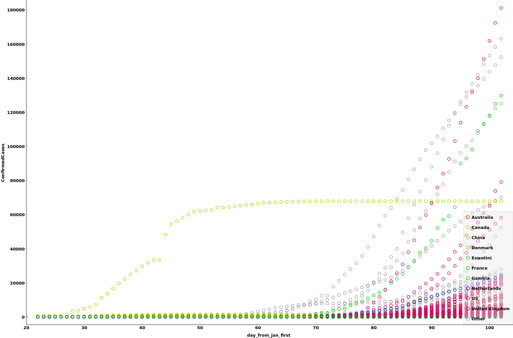
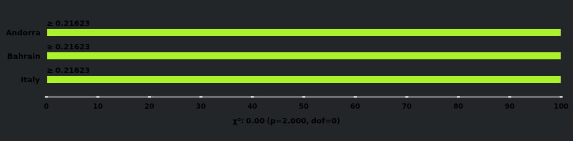
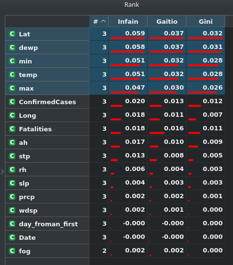

# What data am I using?

https://www.kaggle.com/davidbnn92/weather-data-for-covid19-data-analysis

This set is a merge between a weather data set and the standard covid19 dataset as explained on kaggle. 

# Information

- Number of objects: **25353**
- Number of attributes: **21**

## Attributes:

A few are pretty self explenatory, but I'll try to give an explenation for the attributes which are abbreviations.

- Id
- Province_State
- Country_Region
- Date
- ConfirmedCases
- Fatalities
- country+province
- Lat
- Long
- day_from_jan_first
- temp: Mean temperature for the day in degrees Fahrenheit to tenths. Missing = 9999.9
- min: (temp)
- max: (temp)
- stp: Mean station pressure for the day in millibars to tenths. Missing = 9999.9
- slp: Mean sea level pressure for the day in millibars to tenths. Missing = 9999.9
- dewp: Mean dew point for the day in degreesm Fahrenheit to tenths. Missing = 9999.9
- rh: relative humidity
- ah: absolute humidity
- wdsp: Mean wind speed for the day in knots to tenths. Missing = 999.9
- prcp: percipitation
- fog: true if there was a fog that day, false otherwise. 

## Early Visualizations

Current confirmed cases of the world:

sorry for the color theme, its set to dark on my computer currently, and that reflects on orange. Those three countries were the ones pulled when selecting the countries to have the highest recorded infection rates. 

## Ethical or privacy issues

I don't see much currently. The data is pretty well taken away from people, the only information being the number of cases and location.

# Hypothesis

*A more moist environment increases the rate of infection for covid19.*

# What I will study:

## Time Series Prediction/Classification

I will break apart the data based upon the observed infection rates of the virus and their environments, and I will attempt to gauge if it is more probable that a moist environment has a higher infection rate than a dry one.

I will probably build several models after I find (if any) interesting factors of the data, and I will test these models to help prove or disprove the hypothesis. 

I will be using a combination of the orange software and a jupyter notebook which can be found at:

[https://github.com/dustinc555/csc454_project/blob/master/Project.ipynb](https://github.com/dustinc555/csc454_project/blob/master/Project.ipynb)

