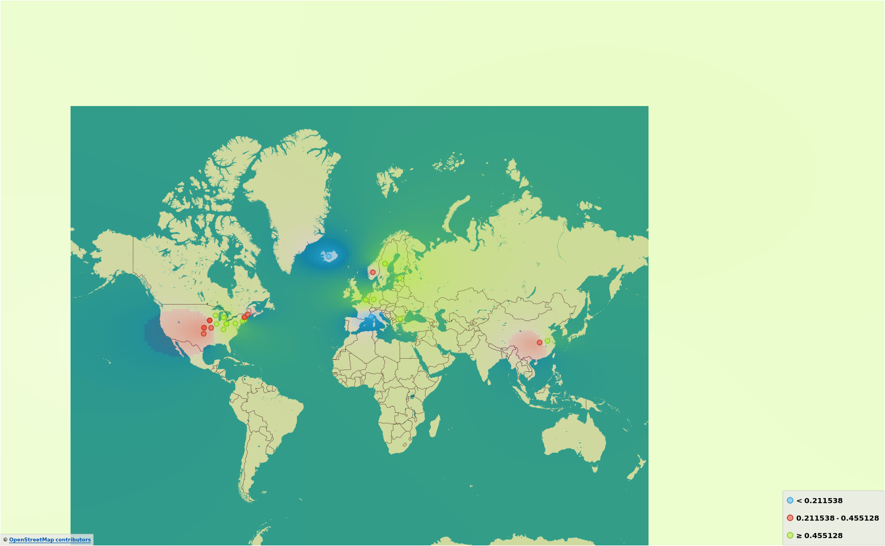

# Description

This analysis attempts to look at the infection rates of COVID-19 in terms of weather conditions.

There are a lot of factors in the spread rate that this data set does not take account for such as:

- Countries dependency on trade
- Number of medical personnel in country
- Local government speed of response
- Population density

So there are definitly times when there will be a high infection rate irreguardless of the weather conditions.

# Data preparation

The process for massaging the data is located in [Project.ipynb](Project.ipynb)

Created features:

- fog_rate | Numerical | Range [0, 1]
- High_infection_rate | Categorical | Range [0, 1] Determined via equal frequency diskritization.

## Early Visualizations

What is kind of interesting

Here we disctitize the data into bins, and we sub group them by high infection rates.

- green: high
- red: medium
- blue: low

I highlighted a few that I found particularly interesting.

# Models

I ran the dataset threw multiple models to extract hidden features from the data set. I would look at what was correctly predicted for high infection rates.

## What am I feeding the models?

Our job is to find out if the weather attributes have any effect on the infection rate. In fact, we are actually just looking for high infection rates, and we want to know if the weather attributes contain specific ranges.

### Fed Attributes

- temp | Mean temperature for the day in degrees Fahrenheit to tenths.
- min | Minimum temperature reported during the day in Fahrenheit to tenths--time of max temp report varies by country and province
- max | Maximum temperature reported during the day in Fahrenheit to tenths--time of max temp report varies by country and province
- stp | Mean station pressure for the day in millibars to tenths
- slp | Mean sea level pressure for the day in millibars to tenths
- dewp | Mean dew point for the day in degreesm Fahrenheit to tenths
- rh | relative humidity
- ah | absolute humidity
- wdsp | Mean wind speed for the day in knots to tenths
- prcp | Total precipitation (rain and/or melted snow) reported during the day in inches and hundredths
- fog_rate | The ratio of a locations summed fog instances and the total number of instances
- fog | Indicators (1 = yes, 0 = no/not reported) for the occurrence during the day

### Target Attribute

**High_Infection_rate**: A bool that indicates if the data instance had an infection rate greater than a defined threshold.

### Training

For training the models I did both 10 cross fold validation and the holdout method, sampling 30% of the data as the test data. Both did similarly well in terms of accuracy; however, I found that the holdout method seemed to help the models conform to a similar range of attributes such as low temp and high fog rate for their true positives.

### Model Summaries

For all of the attributes in question I do a 3-bin equal width discritization. I merge this with the true positives of the model so that I can get a quick estimation of how the models true positives attributes differ overal. So the summary is a table where I will say low if the low bins magnitude overshadows the others and the same for medium and high bins. I will say it favors a bin if there is a noticable increase, but it doesn't really overshadow the others.

For example I would put the following attribute down as Low for the Naive Bayes model:

### Model Statistics

Description of models performance on the data.

- AUC | Area under ROC curve
- CA | Classification Accuracy

### Model Geos

For all of the models true positives, I provide a geo map as well, I color it by fog_rate because I found that rather interesting. They all seemed to have a decent spread over the globe.

## Naive Bayes

For naive bayes, I discritized all of the attributes into 10 equal width frequency bins. It seemed like the more bins added, the better naive bayes performed.

### Summary

| Attribute | Consitration   |
| --------- | -------------- |
| temp      | Low            |
| stp       | Medium         |
| slp       | Low or High    |
| dewp      | Low or Medium  |
| rh        | High           |
| ah        | High           |
| wdsp      | Medium or High |
| prcp      | High           |
| fog_rate  | High           |
| fog       | True           |

## Tree

Originally, I did not rank the data, I just fed in all of the attributes in question, but the decision tree performed very poorly at finding high infection rates. It's true positives for high infection rates were around ~20, so I ranked the data and fed the top 7 attributes. I tried ranking the data to help improve naive bayes as well, but it had no effect.

With ranking the variables, the decision has less to make its decision on, the variables given are:

- fog
- fog_rate
- prcp
- wdsp
- ah
- rh
- dewp

Bayes and the tree end up sharing only 10 objects.

### Summary

| Attribute | Consitration                                |
| --------- | ------------------------------------------- |
| temp      | Favors Low                                  |
| stp       | Favors Low or Medium                        |
| slp       | Favors Low or High                          |
| dewp      | Favors Medium                               |
| rh        | Medium or High                              |
| ah        | Favors Medium or High                       |
| wdsp      | Favors Medium or High                       |
| prcp      | Low (Medium or High have slightly increase) |
| fog_rate  | High                                        |
| fog       | True (smaller increase)                     |

## CN2 Rule Induction

| Accuracy | Precision | Recall | TN   | TP  |
| -------- | --------- | ------ | ---- | --- |
| .692     | .675      | .692   | 7481 | 801 |

The accuracy for the rule generator is low. I could play with it more, but this particular model takes a **long** time to train. I feel like because it's accuracy is low, it may catch more high infection rates, but it fails to find what defines one.

In short, although its accuracy is low, its amount of true postitives is far superior to the other models. If you look at the summary table though, you'll find the attributes are incredibly bland, it isn't really finding key attributes I believe.

I would have provided graphics for this model, but it can take up to an hour to train, so for the sake of time, I stopped and used what I recorded for its last run.

### Summary

| Attribute | Consitration |
| --------- | ------------ |
| temp      | Same         |
| stp       | Same         |
| slp       | Same         |
| dewp      | Same         |
| rh        | Same         |
| ah        | Same         |
| wdsp      | Same         |
| prcp      | Same         |
| fog_rate  | Same         |
| fog       | Same         |

## Neural Network

### Summary

| Attribute | Consitration   |
| --------- | -------------- |
| temp      | Low            |
| stp       | Medium or High |
| slp       | High           |
| dewp      | Low or Medium  |
| rh        | High           |
| ah        | Low or High    |
| wdsp      | Medium or High |
| prcp      | Low or High    |
| fog_rate  | High           |
| fog       | True           |

## SVM

I find it interesting that even though the accuracy is low and it has a high number of true positives, the svm models attributes for these correctly predicted samples still conform similarly to the other models that have a high accuracy and a low number of true positives.

What is especially interesting to me is

The SVM shares almost nothing with the tree; however, it shares almost all instances with Naive Bayes. Ranking the features or not for the tree, still no instances are shared. I personally believe even though the SVM's accuracy is low, it is doing very well at finding what of these attributes cleanly determines between a high infection rate and a low infection rate.

### Summary

| Attribute | Consitration          |
| --------- | --------------------- |
| temp      | Low                   |
| stp       | Low or High           |
| slp       | High                  |
| dewp      | Low or Medium         |
| rh        | Medium or High        |
| ah        | High                  |
| wdsp      | Favors Medium or High |
| prcp      | Low                   |
| fog_rate  | High                  |
| fog       | True                  |

## K-Means

The best split seemed to be three. What is shown is the proportions, but what ended up happening is C3 ended up having the highest high infection rate probability with C2 next and the least probable to have a high infection rate C1.

C3 seemed to pick up the data instances which indicated for a fog on that specific day.

The K-means clustering can not really be used to identify a high infection rate with any decent accuracy, so we will just observe the clusters that have higher infection rates, and note the differences C2 and C3 have from C1.

| Attribute | Consitration   |
| --------- | -------------- |
| temp      | Low            |
| stp       | Favors Medium  |
| slp       | High           |
| dewp      | Favors Medium  |
| rh        | Medium or High |
| ah        | High           |
| wdsp      | Medium or High |
| prcp      | High           |
| fog_rate  | High           |
| fog       | True           |

## Frequent Itemsets

So there is a pretty strong support for Fog=0 => High_Infection_rate=0, this is because this is true for a lot of the data.

We have to scale the support down by a decent amount in order to find a rule that supports fog => high infection rate.

A few issues could be that a large portion of the data actually doesn't record fog, and they could just end up being 0's. Two thirds of the data is also not high infection rate, so that is already much more frequent than high infection rate.

This can be because it is a small subset of the data.

# Summary of Models

Overall, the higher the models accuracy the more a given model would conform to:

| Attribute | Consitration   |
| --------- | -------------- |
| temp      | Low            |
| stp       | Medium         |
| slp       | Low or High    |
| dewp      | Low or Medium  |
| rh        | High           |
| ah        | High           |
| wdsp      | Medium or High |
| prcp      | High           |
| fog_rate  | High           |
| fog       | True           |

There was a trade off between accuracy and true positives. While playing with the models, typically, if I could get the model accuracy higher, the amount of true positives would significantly decrease, but the difference in attributes would conform more. The less the accuracy the more the attributes did not highlight any differences.

# Conclution

> With the given data, I believe that when the attributes in question meet the
> circumstances in the table above can produce the conditions to help the virus
> spread; however, just because a place does not meet these conditions does not mean
> that the virus cannot spread rapidly. What seemed to be especially good attributes
> for predicting if the infection rate was going to be high were:

1. fog_rate | High
2. temperature | Low

I believe that because of other factors there is a large intersection of high infection rates for data instances that do and do not hit these conditions, and it can be hard to pull out of the data. But if you look at the Naive Bays, I think it is true, it is safer to say that something is not a high infection rate if it does not meet the weather requirements.

For the majority of the models, if they have a large number of true positives, they typically have a low accuracy, and this is because they are not correctly identifying a high infection rate. The SVM is a little different though, I think it does, pick up on what Naive Bayes picks up, its just that it tends to overly predict a true positive.

As a final depiction, observe what happens when we first sort on fog rate, and then we sort the two halves on temperature.

